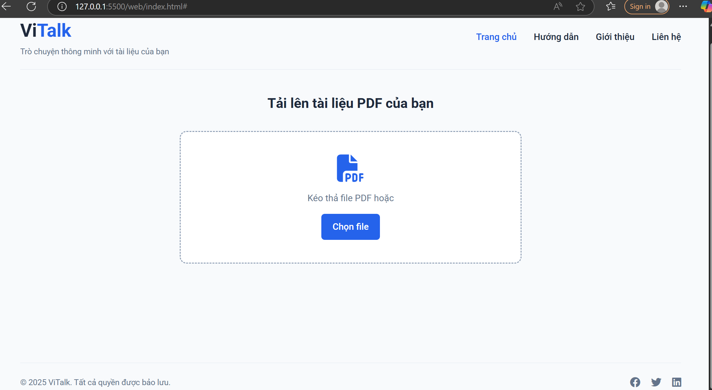

# 🤖 Chatbot_Vietnamese

> Vietnamese-language chatbot powered by LLM for document-based Q&A

## 📄 Description

This project is a Vietnamese-language chatbot built using Large Language Models (LLMs), specifically designed for answering questions based on documents. It applies multiple advanced techniques in Natural Language Processing (NLP), retrieval, and prompt engineering to deliver high-quality and relevant answers.

## ✨ Features

- ✅ Document-based Question Answering
- ✅ Vietnamese language support
- ✅ NLP Preprocessing using [Underthesea](https://github.com/underthesea/underthesea)
- ✅ Semantic Search using FAISS + Maximal Marginal Relevance (MMR)
- ✅ Reranking for improved answer retrieval
- ✅ Prompt Engineering: few-shot learning and prompt optimization
- ✅ API Interface with FastAPI

## 🛠️ Technologies Used

- `LLM` (Gemini)
- `FAISS` for similarity search
- `Hugging Face Transformers`
- `Underthesea` for Vietnamese NLP
- `FastAPI` for serving the chatbot
- `MMR` and `Reranking` strategies

## 🚀 How It Works

1. **Document Ingestion**  
   Upload and chunk documents into manageable pieces.

2. **Preprocessing**  
   Use Underthesea to tokenize and preprocess Vietnamese text.

3. **Semantic Embedding & Indexing**  
   Generate embeddings using a transformer model, then store them in a FAISS index.

4. **Query Processing**  
   User input is preprocessed and embedded.

5. **Retrieval & Reranking**  
   Use FAISS + MMR to retrieve top relevant documents, apply reranking for better relevance.

6. **Prompt Construction & LLM Response**  
   Construct optimized prompts with few-shot examples and feed them to the LLM.

7. **Final Output**  
   Return natural and relevant answers to the user via API.

## 📷 Web Interface

## 👤 Author

**Lê Minh Toàn**  
  [GitHub - Hissatsu265](https://github.com/Hissatsu265)

## 📌 Repository

[🔗 GitHub Repo](https://github.com/Hissatsu265/Chatbot_Vietnamese)

---

Feel free to ⭐ the repo if you find it useful!

